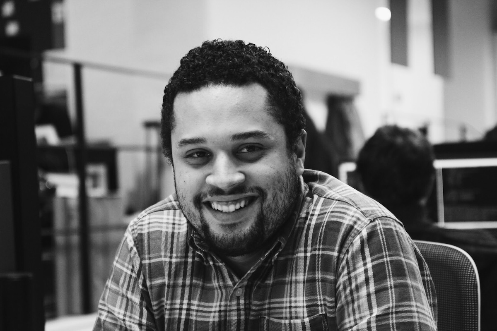

## Ola! I'm Henrique Alves, Frontend Engineer passionated about user experience design and user interfaces.

I love visual design and I care how the product feels for the user. I like the
web, product design, football, black tea and cold weather.

I built my first website in 1999 and 2002 I joined a small digital studio.
Until 2012 I developed micro sites for brands including Nike, Coca-Cola,
Samsung and Olympic Games.

I met amazing and talented people during this time. Also have worked with
different technologies from Processing to WebGL and openFrameworks.

In 2012 I left the industry to build products through companies and startups.

Four simple principles I like to follow when building products:

- Collaboration
- Craftsmanship
- Simplicity
- Flow

I'm living in London, England with my wife and two daughters. Currently working
at [Lystable](http://lystable.com). My previous work experience also includes
[RBS](http://www.rbs.co.uk), [Hailo](http://hailoapp.com),
[The Times](http://www.thetimes.co.uk), [B-Reel](http://b-reel.com) and
[Possible](http://www.possible.com).

Interested in make the web a better place for desktop, mobile and other
platforms. I see the web outside the browser as general-purpose display and
interaction engine.

<iframe
  src="//evening-savannah-30912.herokuapp.com/embed?url=alves.im&emoji=clap"
  scrolling="no"
  frameborder="0"
  style="border:none; overflow:hidden; width:70px; height:35px;"
  allowTransparency="true">
</iframe>

Picture by [Chris T. Olsen](https://twitter.com/ctolsen).

### Speaking

- [React Amsterdam](http://react-amsterdam.com/#speakers) 16 Apr 16
- [HowTo Digital](http://howtodigital.ru) Moscow 30-31 Oct 15
- [FITC](http://fitc.ca/presentation/breaking-the-workflow/) Amsterdam 24th
Feb 15

### Elsewhere

[Twitter](http://twitter.com/healves82),
[GitHub](http://github.com/henriquea),
[LinkedIn](http://linkedin.com/in/healves82),
[Instagram](https://www.instagram.com/healves82/),
[VSCO](http://vsco.co/healves/)
